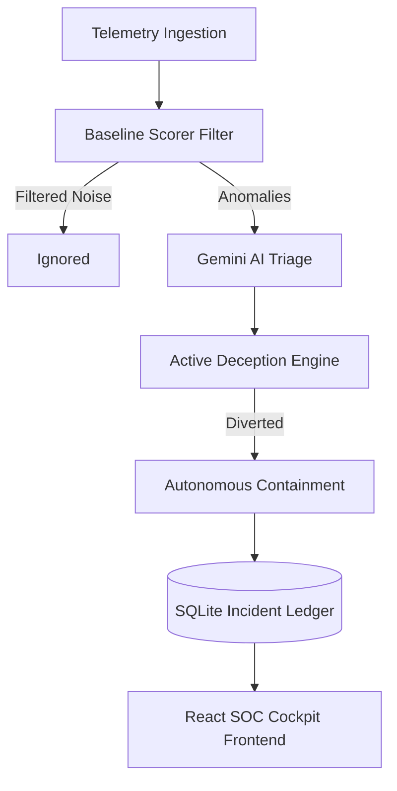

# ATHEUS // Autonomous Cyber Defense & Deception Engine

## Executive Overview
Enterprise SOC teams are currently drowning in alert fatigue, managing thousands of false positives daily. The average adversary dwell time remains stubbornly high (often exceeding 200 days), leaving critical financial and production assets exposed. **Atheus** solves this by autonomously filtering noise, conducting AI-driven forensics, predicting the attacker's blast radius, and trapping them in active honeypot sandboxes before they reach production data.

## Architecture Pipeline



## Core Innovation Matrix

1. **Active Cyber Deception (Dynamic Sandboxing):** Instantly spawns synthetic HoneyDB decoy credentials and environments when lateral movement is detected, diverting the attacker harmlessly.
2. **Predictive Blast Radius:** Uses LLM triage to forecast the next-hop probability of an adversary traversing the network, enabling proactive isolation.
3. **Dual-Lens Reporting:** Generates high-fidelity technical MITRE matrices for forensic analysts, and translates those exact events into clear financial/business risk metrics for C-Suite executives.

## MITRE ATT&CK Mapping

| MITRE ID | Tactic / Technique | Atheus Detection | Atheus Containment Response |
| :--- | :--- | :--- | :--- |
| **T1110** | Brute Force | `baseline_scorer` via attempt thresholds | Dynamic IP Block |
| **T1078** | Valid Accounts | `baseline_scorer` via cross-subnet anomalies | Revoke Session Tokens |
| **T1021** | Lateral Movement | Gemini Correlation Forensics | Active Honey-Trap Sandbox |
| **T1041** | Exfiltration | Egress payload heuristic rules | Total Host Air-gap Isolation |

## Quickstart Guide

### Backend (FastAPI)
```bash
python -m venv venv
source venv/bin/activate
pip install -r requirements.txt
cp .env.example .env
uvicorn backend.app.main:app --reload
```

### Frontend (React + Vite)
```bash
cd frontend
npm install
npm run dev
```
The React app will be available at `http://localhost:3000`.

## API Reference

### POST `/api/v1/telemetry/simulate/burst`
Injects an APT attack sequence into the engine.
**Payload**: `{}`
**Response**: `{"status": "success", "alerts_generated": 4, "dossiers": [...]}`

### POST `/api/v1/containment/execute`
Executes autonomous isolation and active deception.
**Payload**: 
```json
{
  "incident_id": "INC-TEST",
  "attacker_ip": "198.51.100.23",
  "compromised_user": "svc_deployer",
  "bastion_ip": "10.0.1.10",
  "trigger_deception": true,
  "target_ip": "10.0.2.45"
}
```
**Response**: `{"status": "success", "actions": [{"action": "IP_BLOCK", ...}], "deception_status": {...}}`

### POST `/api/v1/copilot/chat`
Interacts with the AI Copilot for forensic investigation.
**Payload**: `{"incident_id": "INC-123", "query": "Why was host isolated?"}`
**Response**: `{"reply": "...", "cited_events": ["T1021"]}`
